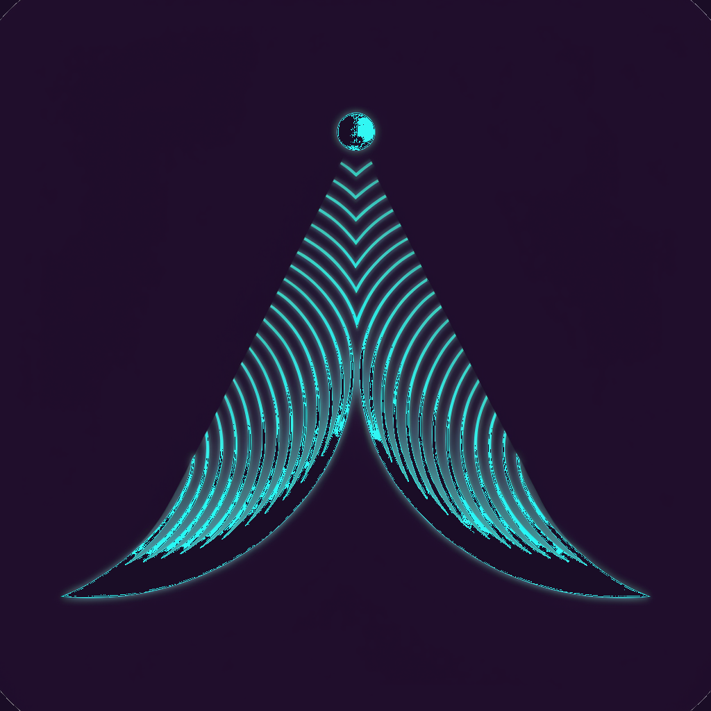
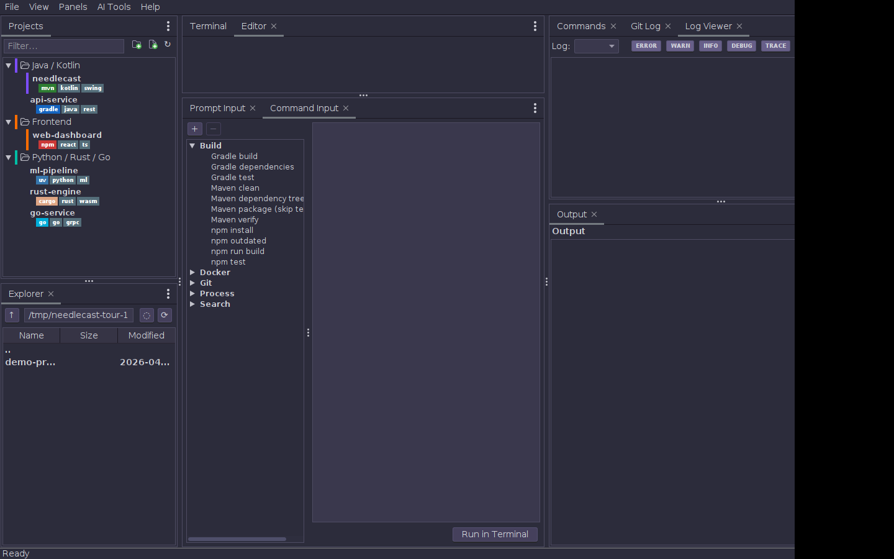
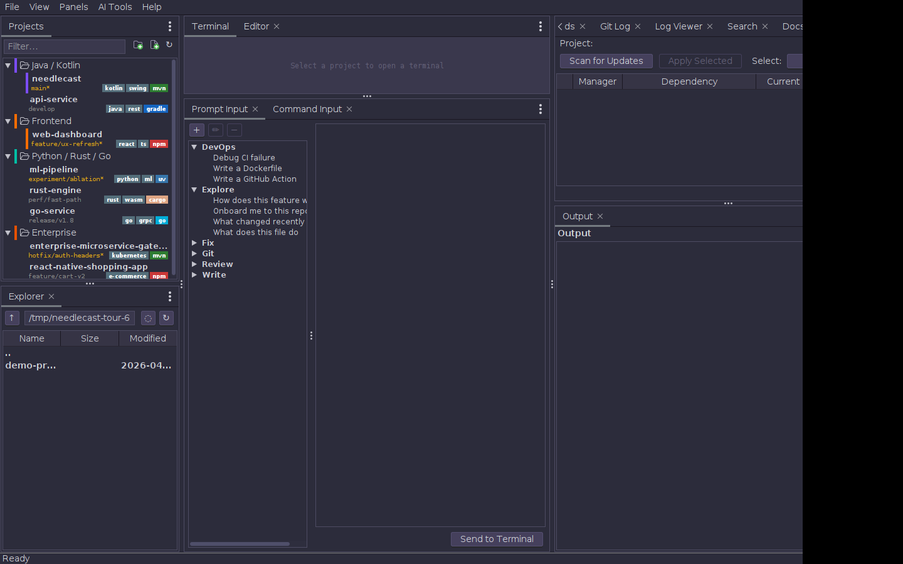
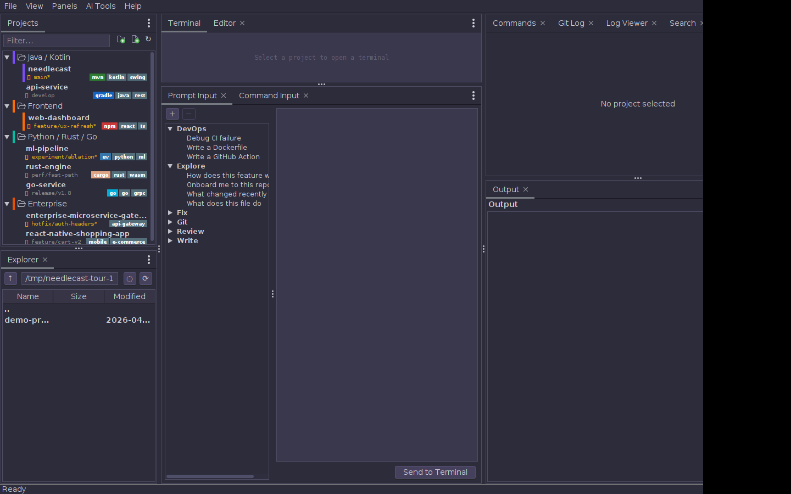
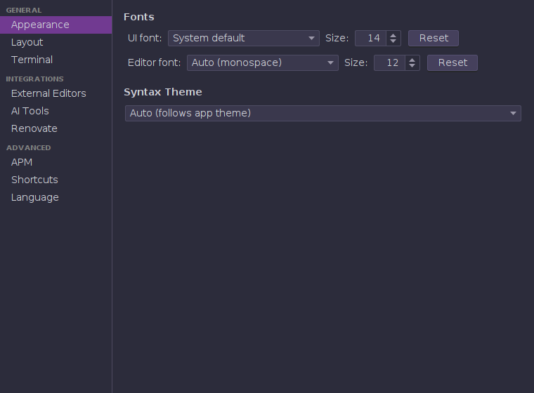
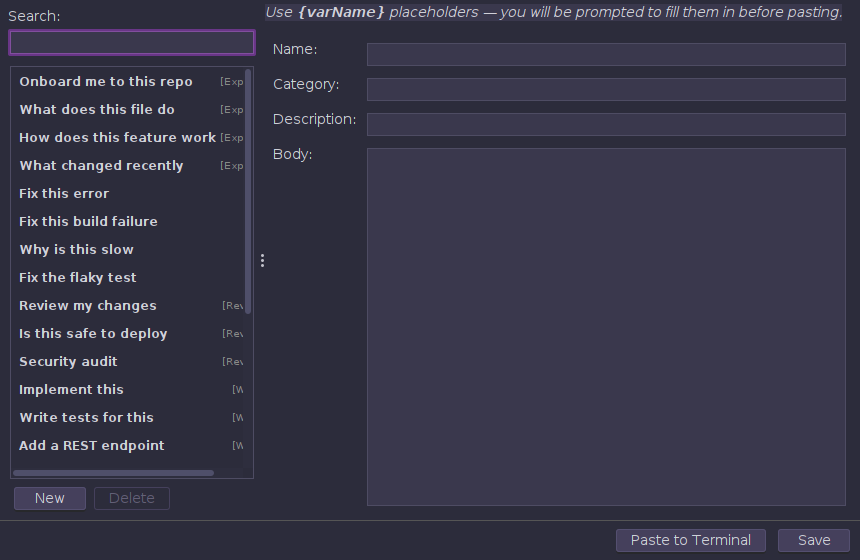
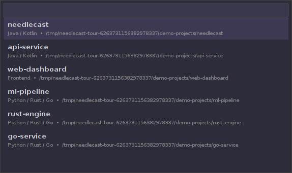

<p align="center">
  
</p>

<h1 align="center">Needlecast</h1>

<p align="center">
  A modern approach for an agentic coding environment<br><br>
  Use any vibe coding CLI and get tooling around it to quickly edit files or interact with media files. When even VS Code is too heavy. Offers a customizable project tree for all 100+ projects you created this week alone XD 
</p>

<p align="center">
  <a href="https://github.com/rygel/needlecast/actions/workflows/ci.yml"></a>
  <a href="https://github.com/rygel/needlecast/releases/latest"></a>
  <a href="https://github.com/rygel/needlecast/releases"></a>
  <a href="LICENSE"></a>
  
</p>

## Features

**Project management**
- Organize your projects into color-coded groups with a tree-style sidebar
- Fuzzy project switcher (`Ctrl+P`) across all groups
- Edit and view all text files in the integrated text editor with syntax highlighting
- Media viewer for images, audio, video (when you generate media via AI)
- Git branch and dirty-state indicator per project
- Run you build scripts from the UI
- Create and manage you personal prompt library (alpha)
- Manage your skills from within the application (alpha)
- Run [renovate](https://github.com/renovatebot/renovate) to keep you dependencies up-to-date
- Environment variables per project, injected into commands and terminals
- File explorer automatically switches to the active project's directory



**Commands**
- Auto-detects build tools across 14 language ecosystems — no configuration needed:

  | Language | Build tool | Detected from | Highlights |
  |----------|-----------|---------------|------------|
  | Java / Kotlin | **Maven** | `pom.xml` | Lifecycle goals, plugin detection (Spring Boot, Quarkus, JavaFX, exec), submodules |
  | Java / Kotlin | **Gradle** | `build.gradle(.kts)` | Tasks, plugin detection (Spring Boot, Shadow, Compose Desktop), subprojects |
  | JavaScript / TypeScript | **npm** | `package.json` | Extracts scripts, preferred ordering (dev, start, build, test) |
  | Python | **uv** | `uv.lock` or `[tool.uv]` | sync, run, build, test, lock |
  | Python | **Poetry** | `poetry.lock` or `[tool.poetry]` | install, run, build, test, lock |
  | Python | **pip** | `pyproject.toml` / `requirements.txt` | Fallback when no lock file detected |
  | Rust | **Cargo** | `Cargo.toml` | build, test, run, check, clippy, fmt; workspace members |
  | Go | **Go** | `go.mod` | build, test, vet, fmt; `main.go` and `cmd/` detection |
  | C# / F# / VB | **.NET** | `.sln` / `.csproj` | Solution parsing, web/test/runnable project detection |
  | PHP | **Composer** | `composer.json` | Script extraction, Laravel artisan detection |
  | Ruby | **Bundler** | `Gemfile` | Rails server/console/test, Rakefile detection |
  | Swift | **SPM** | `Package.swift` | build, test, run, package resolve |
  | Dart | **pub** | `pubspec.yaml` | run, test, compile, analyze |
  | Dart | **Flutter** | `pubspec.yaml` + `sdk: flutter` | run, build (apk/ios/web), test, analyze |
  | C / C++ | **CMake** | `CMakeLists.txt` | configure, build, ctest, install |
  | C / C++ | **Make** | `Makefile` | make, clean, test, install |
  | Scala | **sbt** | `build.sbt` | compile, test, run, assembly |
  | Elixir | **Mix** | `mix.exs` | compile, test, format; Phoenix server/ecto detection |
  | Zig | **Zig** | `build.zig` | build, test, run, fmt |
  | — | **IntelliJ Run Configs** | `.idea/runConfigurations/` | Application, JUnit, Maven goal configs |
  | — | **APM** | `apm.yml` | install, audit, update, bundle |

- Command queue — chain commands to run sequentially (clean → build → run)
- Command history with re-run support (last 20 per project)
- Desktop notification when a command finishes in the background

**Terminal**
- Embedded JediTerm terminal per project
- Multiple tabs per project
- Configurable font size (`Ctrl+scroll`)
- Terminal colors automatically inherit the active UI theme; override per-color in Settings

**Editor**
- Syntax-highlighted editor (RSyntaxTextArea) with multiple tabs
- Selectable syntax theme (Monokai, Eclipse, IntelliJ IDEA, VS, and more) — Settings → Layout & Terminal
- Font zoom (`Ctrl+scroll`, 6–72 pt); zoom survives theme switches
- Find & Replace (`Ctrl+F` / `Ctrl+H`)
- File explorer with right-click context menu (create, rename, delete, copy path)
- Show/hide hidden files toggle
- Tab right-click menu: Close, Close All to the Left, Close All to the Right, Close All

**Image & SVG viewer**
- Click any image file to open an inline viewer (JPEG, PNG, WebP, GIF, BMP, TIFF, ICO)
- Click `.svg` files for a vector viewer — stays crisp at any zoom level
- `Ctrl+scroll` to zoom, double-click to reset to fit
- Re-clicking a file that has changed on disk reloads it automatically

**Log Viewer**
- Dockable panel that discovers `.log` files in the active project
- Live tailing with 500ms polling and log rotation detection
- Colour-coded log levels: ERROR (red), WARN (orange), DEBUG/TRACE (grey)
- Level filtering toggles, follow mode (auto-scroll), and incremental search (`Ctrl+F`)
- Supports Logback, Log4j2, JSON structured logs, and plain text with stack trace grouping

**Renovate (dependency updates)**
- Dockable panel that scans the active project for outdated dependencies
- Runs `renovate --platform=local` — no token or GitHub access needed
- Results shown in a sortable table: dependency, current version, available version, update type
- Colour-coded: major (red), minor (orange), patch (green)
- Select updates and apply them directly to project files (Maven properties, Dockerfiles, etc.)
- Install Renovate via Settings → Renovate tab (npm, Scoop, Chocolatey, Homebrew)

**AI & Prompts**
- Prompt Library — reusable templates with `{variable}` substitution, paste into active terminal
- AI Tools menu with auto-detected CLI tools (Claude, Gemini, Codex, apm, …)

**Appearance & Layout**
- Follows OS dark/light theme automatically (FlatLaf with 30+ bundled themes)
- Dockable, resizable panels — layout persists across sessions
- README preview below the command list when a project is selected
- Git log viewer with `git show` on click
- Keyboard shortcut editor — rebind any default shortcut
- Automatic update checks every 15 minutes with Sparkle4j

## Screenshots

| Main Window | Renovate Panel | Log Viewer |
|:-----------:|:--------------:|:----------:|
|  |  |  |

| Settings | Prompt Library | Project Switcher |
|:--------:|:--------------:|:----------------:|
|  |  |  |

Screenshots are auto-generated in CI on every push to develop.

## Requirements

- Java 21 or later
- Windows, macOS, or Linux

## Running

```bash
mvn -pl needlecast-desktop compile exec:java
```

Or build a JAR first:

```bash
mvn -pl needlecast-desktop -am package -DskipTests
java -jar needlecast-desktop/target/needlecast-desktop-0.6.17.jar
```

## Building from source

```bash
git clone https://github.com/rygel/needlecast.git
cd needlecast
mvn -pl needlecast-desktop -am package -DskipTests
```

Run the full test suite (non-UI tests only — UI tests require Xvfb):

```bash
mvn -pl needlecast-desktop test -T 4 -Dexcludes="**/*UiTest.java,**/*UiTest.kt"
```

> Full Swing/desktop UI tests require Xvfb — see [CONTRIBUTING.md](.github/CONTRIBUTING.md) for the container-based setup.

## Keyboard shortcuts

| Shortcut | Action |
|----------|--------|
| `Ctrl+P` | Project switcher (fuzzy search across all groups) |
| `Ctrl+T` | Focus / open terminal |
| `F5` | Rescan projects |
| `Ctrl+1` | Focus project list |
| `Ctrl+2` | Focus command list |
| `Ctrl+3` | Focus console |
| `Ctrl+F` | Find in console output or editor |
| `Ctrl+H` | Replace in editor |
| `Ctrl+scroll` | Zoom editor or terminal font |

Shortcuts can be rebound in **Settings → Shortcuts**.

## Configuration

Config is stored in `~/.needlecast/config.json` and migrated automatically on version upgrades.

### Environment variables per project

Open a project's context menu → **Environment Variables**. Key/value pairs are injected into every command and terminal session for that project.

## Logging

Log output goes to `~/.needlecast/needlecast.log` (rotates at 10 MB, keeps 5 archives). Warnings and errors are also printed to stderr.

## Changelog

See [CHANGELOG.md](CHANGELOG.md).

## Documentation

See the docs index at [docs/README.md](docs/README.md).

## Contributing

See [CONTRIBUTING.md](.github/CONTRIBUTING.md).

## License

MIT — see [LICENSE](LICENSE).
