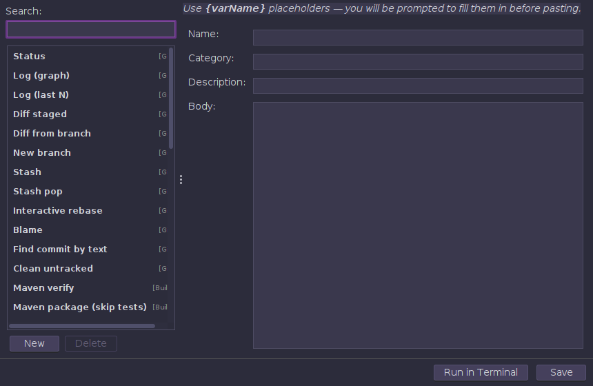
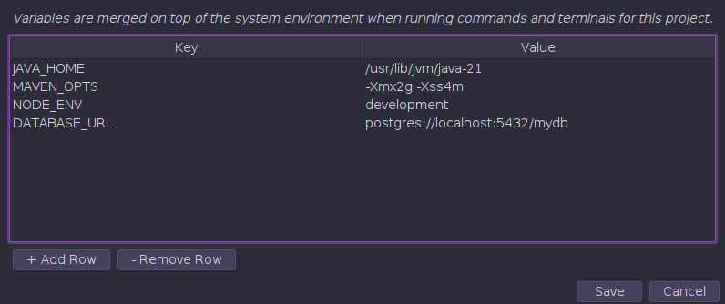
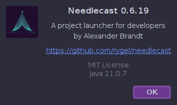

# Needlecast User Guide

> Screenshots in this guide are auto-generated by CI and always reflect the current UI.

## Overview

Needlecast is a project launcher for developers. It organizes your projects into groups, auto-detects build commands, embeds terminals, browses files, and tracks git status — all from one window.


---

## Getting Started

### Installation

**Windows (64-bit)** — Download `needlecast-VERSION-win64.exe` from [Releases](https://github.com/rygel/needlecast/releases). Run the installer. Needlecast appears in the Start Menu.

**macOS** — Download `needlecast-VERSION-macos.dmg`. Open the DMG and drag Needlecast to Applications.

**Linux** — Download `needlecast-VERSION-linux-amd64.deb` and install:
```bash
sudo dpkg -i needlecast-*.deb
```

**From source** — Requires Java 21:
```bash
git clone https://github.com/rygel/needlecast.git
cd needlecast
mvn -pl needlecast-desktop compile exec:java
```

### First Launch

On first launch, Needlecast creates an empty project tree. Add your projects:

1. Right-click the project tree → **New Folder** to create a group
2. Right-click the folder → **Add Project** to add a project directory
3. Needlecast scans the directory and auto-detects build commands

---

## Project Tree

The left sidebar organizes your projects into color-coded folders.

### Folders

- **New Folder** — right-click the tree background or any folder
- **Rename** — right-click a folder → Rename
- **Set Color** — right-click → Set Color to assign a left-edge color stripe
- **Remove** — removes from the list (does not delete files)
- **Delete from disk** — under Advanced submenu, permanently deletes project directories

### Projects

Each project shows:
- **Name** — the directory name (or custom display name)
- **Branch** — current git branch and dirty indicator (`*`)
- **Tags** — build tool badges (mvn, gradle, npm, cargo, uv, go, composer, etc.) and custom tags
- **Color stripe** — optional per-project color

Right-click a project for:
- **Activate/Deactivate Terminal** — start or stop a terminal session
- **Tags** — add custom tags (comma-separated)
- **Shell Settings** — custom shell executable and startup command per project
- **Environment** — per-project environment variables

### Drag and Drop

Drag projects between folders to reorganize. Tags and settings are preserved.

### Project Switcher (Ctrl+P)

Press **Ctrl+P** to open the fuzzy project switcher — search across all groups.


---

## Commands

When you select a project, Needlecast scans its build files and shows detected commands. The following languages and build tools are auto-detected:

| Language | Build tool | Detected from | Highlights |
|----------|-----------|---------------|------------|
| Java / Kotlin | **Maven** | `pom.xml` | Lifecycle goals, plugin detection (Spring Boot, Quarkus, JavaFX, exec), submodules |
| Java / Kotlin | **Gradle** | `build.gradle(.kts)` | Tasks, plugin detection (Spring Boot, Shadow, Compose Desktop), subprojects |
| JavaScript / TypeScript | **npm** | `package.json` | Extracts scripts, preferred ordering (dev, start, build, test) |
| Python | **uv** | `uv.lock` or `[tool.uv]` | sync, run, build, test, lock |
| Python | **Poetry** | `poetry.lock` or `[tool.poetry]` | install, run, build, test, lock |
| Python | **pip** | `pyproject.toml` / `requirements.txt` | Fallback when no lock file detected |
| Rust | **Cargo** | `Cargo.toml` | build, test, run, check, clippy, fmt; workspace members |
| Go | **Go** | `go.mod` | build, test, vet, fmt; `main.go` and `cmd/` detection |
| C# / F# / VB | **.NET** | `.sln` / `.csproj` | Solution parsing, web/test/runnable project detection |
| PHP | **Composer** | `composer.json` | Script extraction, Laravel artisan detection |
| Ruby | **Bundler** | `Gemfile` | Rails server/console/test, Rakefile detection |
| Swift | **SPM** | `Package.swift` | build, test, run, package resolve |
| Dart | **pub** | `pubspec.yaml` | run, test, compile, analyze |
| Dart | **Flutter** | `pubspec.yaml` + `sdk: flutter` | run, build (apk/ios/web), test, analyze |
| C / C++ | **CMake** | `CMakeLists.txt` | configure, build, ctest, install |
| C / C++ | **Make** | `Makefile` | make, clean, test, install |
| Scala | **sbt** | `build.sbt` | compile, test, run, assembly |
| Elixir | **Mix** | `mix.exs` | compile, test, format; Phoenix server/ecto detection |
| Zig | **Zig** | `build.zig` | build, test, run, fmt |

### Multi-module detection

- **Maven** — parses `<modules>` and generates `-pl module -am` commands. Detects Spring Boot, Quarkus, Jetty, exec-maven-plugin per module.
- **Gradle** — parses `settings.gradle(.kts)` for subproject tasks. Detects Spring Boot, Shadow, Compose Desktop per subproject.
- **Rust** — parses `[workspace] members` from `Cargo.toml` for per-crate `cargo build -p` and `cargo test -p`.
- **Go** — detects `cmd/` subdirectories for per-binary `go build ./cmd/name` and `go run ./cmd/name`.
- **.NET** — parses `.sln` for project references. Generates per-project `run`, `test`, `watch` based on SDK type and PackageReferences.

### Running commands

- **Click** a command to select it, then press **Run**
- **Double-click** a command to run it immediately
- **Queue** button chains commands sequentially (clean → build → run)
- **Cancel** stops the running command

Command output appears in the **Output** panel.

---

## Output Panel

The Output panel shows command stdout/stderr with search and context menu.

- **Ctrl+F** — find in output
- **Right-click** → Copy, Select All, Clear
- **Mouse wheel** scrolls the output

---

## Terminal

Each project can have its own embedded terminal (JediTerm). Activate via right-click → Activate Terminal or the project context menu.

- **Ctrl+scroll** to zoom font size
- Multiple tabs per project
- Custom shell per project (bash, zsh, PowerShell, etc.)
- Startup command (e.g., `conda activate ml`)
- Terminal colors inherit the active theme; override in Settings

### AI Agent Detection

When Claude Code or other AI CLIs are running in a terminal, Needlecast shows a status LED:
- **Thinking** — spinner detected in output
- **Waiting** — terminal idle

---

## File Explorer

The Explorer panel shows the active project's directory. Double-click files to open them.

### Editor

- Syntax highlighting for 40+ languages (RSyntaxTextArea)
- **Ctrl+scroll** to zoom
- **Ctrl+F** — Find, **Ctrl+H** — Replace
- Tab right-click: Close, Close All to the Left/Right, Close All
- Unsaved changes prompt before closing

### Image & SVG Viewer

Click image files (JPEG, PNG, WebP, GIF, BMP, TIFF, ICO) for an inline viewer. Click `.svg` files for a vector viewer. **Ctrl+scroll** to zoom, **double-click** to reset.

---

## Prompt Library

Reusable prompt templates with `{variable}` substitution. Paste into the active terminal.


Categories: Explore, Fix, Review, Write, Git, DevOps. Each prompt is actionable — demands specific answers, not generic advice.

### Command Library

Same interface but for shell commands — Git, Maven, Gradle, npm, Docker, Search, Process/Network.



---

## Settings


### General
- **Theme** — 30+ themes: Dark Purple, Dracula, Nord, Catppuccin, and more
- **Language** — English, German
- **External editors** — configure VS Code, IntelliJ, Zed for "Open in editor" actions

### Layout & Terminal
- **Tab placement** — top or bottom
- **Diagnostics** — enable project tree click tracing and EDT stall monitor (logs to `~/.needlecast/needlecast.log`)
- **Syntax theme** — Monokai, Eclipse, IntelliJ IDEA, VS, and more
- **Terminal colors** — custom foreground/background or inherit from theme
- **Terminal font size**

### Shortcuts
- Rebind any keyboard shortcut

### AI Tools
- Enable/disable detected AI CLIs (Claude, Gemini, Codex, etc.)
- Add custom AI CLI definitions

### Renovate / APM
- One-click install buttons for Renovate and APM
- Command output streams live in an embedded panel (no need to switch to the terminal)
- Recheck button verifies installation status

---

## Environment Variables

Per-project environment variables injected into every command and terminal session.



---

## About



---

## Git Integration

### Branch indicator
Each project shows the current git branch and dirty state (`*`) in the project tree.

### Git Log
The Git Log panel shows recent commits. Click a commit to see `git show` output.

---

## Log Viewer

The **Log Viewer** panel discovers and displays log files from the active project. Open it from **Panels → Log Viewer** (or it may already be tabbed alongside Git Log).


### Features

- **Auto-discovery** — scans `target/`, `logs/`, `log/`, `build/`, `out/` and the project root for `.log` files
- **Live tailing** — polls the active log file every 500ms for new content
- **Colour-coded levels** — ERROR (red, bold), WARN (orange), INFO (default), DEBUG (grey), TRACE (grey, italic)
- **Level filtering** — toggle buttons to show/hide each log level
- **Follow mode** — auto-scrolls to newest entries (click the arrow button or scroll manually to disable)
- **Search** — `Ctrl+F` for incremental search with match highlighting and navigation (Enter/Shift+Enter)
- **Log rotation detection** — if a file shrinks (rotated), the viewer reloads from the beginning
- **Stack trace grouping** — lines starting with `at`, `Caused by:`, or `...` are grouped with the preceding log entry

### Supported formats

- **Logback** — `HH:mm:ss.SSS [thread] LEVEL logger - message`
- **Log4j2** — `YYYY-MM-DD HH:mm:ss,SSS LEVEL [thread] logger - message`
- **JSON lines** — `{"timestamp":..., "level":..., "message":...}`
- **Plain text** — keyword detection (ERROR, WARN, DEBUG, TRACE)

---

## Renovate (Dependency Updates)

The **Renovate** panel scans the active project for outdated dependencies and lets you apply updates. Open it from **Panels → Renovate**.


### Scanning

Click **Scan for Updates** to run `renovate --platform=local` against the active project. No GitHub token is needed — Renovate reads the local build files directly. Results appear in a sortable table:

- **Manager** — which build system (maven, npm, dockerfile, github-actions, etc.)
- **Dependency** — the package name
- **Current** / **Available** — version comparison
- **Type** — colour-coded: **major** (red), **minor** (orange), **patch** (green)

The summary bar shows total counts (e.g. "20 updates available: 2 major, 9 minor, 7 patch, 2 other").

### Applying updates

1. Check the boxes next to the updates you want to apply
2. Use the quick-select buttons: **All**, **None**, or **Patch only** (safest)
3. Click **Apply Selected** — a confirmation dialog shows what will change, with a warning for major (breaking) updates
4. Needlecast modifies the version strings in your project files directly (Maven properties, Dockerfile tags, etc.)

### Installing Renovate

If Renovate is not installed, the panel shows a hint. Install it via **Settings → Renovate** tab, which provides one-click install buttons for npm, Scoop, Chocolatey, or Homebrew.

---

## Updates

Needlecast checks for updates every 15 minutes and via **Help → Check for Updates**. When a new version is available, a dialog shows the release notes and offers to download the installer.

The update feed uses the [Sparkle appcast format](https://sparkle-project.org/) via [sparkle4j](https://github.com/rygel/sparkle4j).

---

## Configuration

Config is stored in `~/.needlecast/config.json` and migrated automatically on version upgrades.

### Import/Export

**File → Import Config** and **File → Export Config** allow backing up and sharing your project setup.

---

## Keyboard Shortcuts

| Shortcut | Action |
|----------|--------|
| `Ctrl+P` | Project switcher (fuzzy search) |
| `Ctrl+T` | Focus / open terminal |
| `F5` | Rescan projects |
| `Ctrl+1` | Focus project list |
| `Ctrl+2` | Focus command list |
| `Ctrl+3` | Focus output panel |
| `Ctrl+F` | Find in output or editor |
| `Ctrl+H` | Replace in editor |
| `Ctrl+scroll` | Zoom editor or terminal font |

All shortcuts can be rebound in **Settings → Shortcuts**.

---

## Logging

Logs go to `~/.needlecast/needlecast.log` (rotates at 10 MB, keeps 5 archives).

---

*This guide is part of the [Needlecast](https://github.com/rygel/needlecast) project by Alexander Brandt. Licensed under MIT.*
